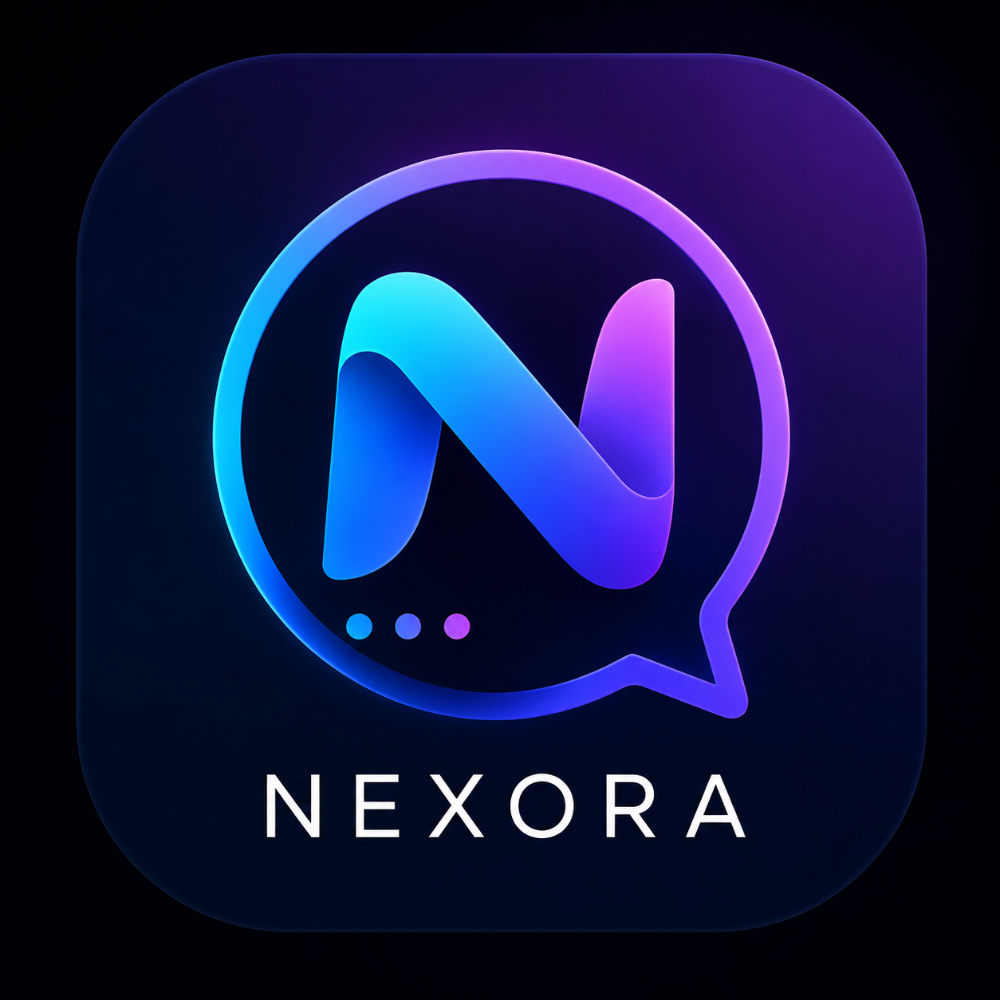

<p align="center">
  
</p>

<h1 align="center">⭐ Nexora — Объединяя людей без границ</h1>

<p align="center">
  
  
  
  
  
</p>

<p align="center">
  <b>Мессенджер нового поколения</b> — безопасное, быстрое и приватное общение без границ.<br/>
  Личные и групповые чаты, секретные чаты с самоуничтожением, 3D-подарки,
  боты, группы и каналы, мультиязычность и вход через GitHub / Google / Yandex.
</p>

<p align="center">
  📰 <a href="NEWS.md"><b>Читать большую новость и анонс Nexora →</b></a>
</p>

---

## 📑 Оглавление

- [О проекте](#о-проекте)
- [Почему Nexora](#почему-nexora)
- [Возможности](#возможности)
  - [Общение](#общение)
  - [Секретные чаты](#секретные-чаты)
  - [Подарки](#подарки)
  - [Боты](#боты)
  - [Профиль и персонализация](#профиль-и-персонализация)
  - [Вход и аккаунт](#вход-и-аккаунт)
  - [Мультиязычность](#мультиязычность)
  - [Уведомления](#уведомления)
- [Архитектура](#архитектура)
- [Клиенты](#клиенты)
- [Быстрый старт](#быстрый-старт)
- [Telegram-бот и канал](#telegram-бот-и-канал)
- [Безопасность](#безопасность)
- [Дорожная карта](#дорожная-карта)
- [Nexora Premium](#nexora-premium)
- [Части проекта](#части-проекта)
- [Лицензия и поддержка](#лицензия-и-поддержка)

---

## 🌟 О проекте

**Nexora** — это современный мессенджер, созданный с целью дать людям простое,
быстрое и приватное общение без привязки к одной экосистеме. Nexora работает
везде: в браузере, на Windows, и (в разработке) на Android и iOS. В основе лежит
привычный для пользователей Telegram формат общения, расширенный современными
фишками — секретными чатами с самоуничтожением, 3D-подарками и гибкой настройкой.

Проект развивается открыто: готовые сборки и документация публикуются в этом
репозитории, а сообщество растёт через официальный канал в Telegram.

> 🟢 **Nexora полностью бесплатна.** Все функции доступны без ограничений.
> Платные подписки Nexora Premium появятся в будущем, но базовый мессенджер
> останется бесплатным навсегда.

---

## 💡 Почему Nexora

- **Без границ.** Один аккаунт — и ты в чатах с любого устройства.
- **Приватность по умолчанию.** Секретные чаты с E2EE и таймером уничтожения.
- **Понятно.** Интерфейс в духе привычных мессенджеров — не нужно учиться.
- **Богато.** Подарки, боты, группы, каналы, темы, фоны, реакции.
- **Открыто.** Сборки, новости и исходники клиентов — на виду у сообщества.

---

## ✨ Возможности

### Общение
- 🔐 **E2EE** — сквозное шифрование в секретных чатах (AES-GCM, ключ из пароля комнаты).
- 💬 **Личные и групповые чаты** — переписка в реальном времени по WebSocket.
- 📢 **Группы и каналы** — описание, владелец, участники, авто-вступление.
- 📎 **Фото, видео и файлы** — отправка в один тап, с превью и скачиванием.
- 🎤 **Голосовые сообщения** и 🟣 **видеокружки** — запись прямо в чате.
- ✍️ **Статус «печатает…»** и индикаторы активности.
- 🔎 **Поиск** по чатам и сообщениям в шапке главного экрана.
- 🗂 **Фильтры** чатов: Все / Непрочитанные / Группы / Секретные.
- 🔔 **Непрочитанные** — счётчик и выделение диалогов с новыми сообщениями.

### Секретные чаты
Полностью приватные беседы один-на-один:
- Сквозное шифрование (AES-GCM), ключ выводится из пароля комнаты.
- ⏳ **Самоуничтожение** сообщений: 10 секунд / 1 минута / 1 час / 1 день.
- Сообщение исчезает у обоих сторон автоматически по таймеру.
- В списке чатов помечаются значком 🔒.

### Подарки
- 🎁 **3D-подарки** — красивые анимированные открытки (роза, звезда, сердце, корона, ракета, бриллиант).
- 🛒 **Магазин подарков**, аукционы и личная коллекция.
- 💎 Внутренняя валюта **Stars** для покупки и дарения.
- Подарок приходит в чат уведомлением с анимацией.

### Боты
- 🤖 **Создание ботов** прямо в интерфейсе — имя, токен, авто-ответы.
- ↩️ Авто-ответ на команды (например, `/start`) и на упоминания.
- Боты работают внутри платформы Nexora.

### Профиль и персонализация
- 👤 **Профиль как в Telegram** — `username`, имя, фамилия, био, дата рождения, язык, условный «дата-центр» (1–5).
- 🆔 **Уникальный ID** (`@id...`) для поиска друзей и отправки подарков.
- 🎨 **Фон чата** — готовые тёмные темы + своё фото из галереи.
- 🌗 **Светлая и тёмная тема** интерфейса с плавными анимациями.
- 🔋 **Энергосбережение** — отключение анимаций для слабых устройств.

### Вход и аккаунт
- 📧 **Регистрация по email** + код подтверждения (код приходит на почту).
- 🔑 **OAuth** — вход через GitHub / Google / Yandex (при наличии ключей провайдера).
- 🧹 **Автоудаление** неактивных аккаунтов (период 6 месяцев).
- 🛡 **Панель администратора** (`/dev`) — баннеры, режим техобслуживания, баны, значки, уведомления.

### Мультиязычность
- 🌍 **10 языков**: русский, английский, украинский, немецкий, испанский,
  французский, китайский, турецкий, арабский, португальский.
- Переключение языка интерфейса в настройках.

### Уведомления
- 🔔 Настройки уведомлений о сообщениях, звука и вибрации.
- 📱 Отдельный раздел «Устройства» в настройках.

---

## 🧩 Архитектура

Nexora — это связка из нескольких частей, работающих вместе:

| Часть | Назначение | Технологии |
|-------|-----------|------------|
| Бэкенд | Сервер, API, WebSocket, хранение | Python, Flask, Flask-Sock, SQLite |
| Веб-клиент | Интерфейс в браузере | HTML, CSS, JavaScript |
| Мобильный клиент | Android / iOS | Flutter, `web_socket_channel` |
| Десктоп | Windows-сборка | Python → exe (PyInstaller) |
| Telegram-бот | Официальный бот и канал новостей | Python, python-telegram-bot |

- **Реальное время** обеспечивается WebSocket-соединением (`flask-sock`).
- **Хранение** — SQLite (файл `nexora.db`); для продакшена возможен внешний сервер БД.
- **Безопасность** — права администратора проверяются только на сервере, пароли и ключи держатся в переменных окружения (`.env`).
- **Деплой** — команда запуска `python app.py`; процесс слушает порт из переменной `PORT`.

---

## 📱 Клиенты

| Платформа | Статус | Как получить |
|-----------|--------|--------------|
| 🪟 Windows | ✅ Готово | `Nexora-Windows.exe` в разделе [Releases](../../releases) |
| 🌐 Web | ✅ Готово | Открывается в браузере при запуске сервера |
| 🤖 Android | 🛠 Исходник (Flutter) | Сборка в CI / локально (`flutter build apk`) |
| 🍎 iOS | 🛠 Исходник (Flutter) | Требует Mac + Xcode: `flutter create .` → `flutter build ios` |
| 📲 Telegram | ✅ Бот + канал | [@NexoraQ_News](https://t.me/NexoraQ_News) |

### 📱 Мобильные клиенты (Flutter)
Исходный код мобильного приложения (**Android + iOS**) уже в репозитории — папка `nexora-mobile/`
(Flutter, `web_socket_channel`, `http`). Это полноценный чат-клиент: логин, список чатов,
экран переписки и WebSocket-соединение с бэкендом Nexora.

- **Android**: собирается в APK/AAB (`flutter build apk`).
- **iOS**: требует Mac с Xcode. В папке пока нет сгенерированного `ios/` —
  на MacBook выполни `flutter create .`, затем `flutter build ios`.
- Бэкенд-URL задаётся в `nexora-mobile/lib/config.dart`.

---

## 🚀 Быстрый старт

1. Скачай сборку для своей платформы в разделе [Releases](../../releases)
   (Windows — `Nexora-Windows.exe`).
2. Запусти приложение → введи email → получи код → введи его.
3. Общайся! Твой ID показан внизу чата — дай его друзьям для подарков.

> 💡 Вход также доступен через GitHub, Google и Yandex (если включено в сборке/на сервере).

### Запуск сервера (для самостоятельного деплоя)
```bash
# переменные окружения задаются в .env
PORT=5000
python app.py
```
Команда процесса для хостинга: `web: python app.py` (см. `Procfile`).

---

## 🤖 Telegram-бот и канал

Официальное присутствие Nexora в Telegram:

- 📰 **Канал новостей**: [@NexoraQ_News](https://t.me/NexoraQ_News) — анонсы, релизы, важное.
- 🤖 **Бот** — приветствие, ссылки на приложения, команды `/start`, `/news`, `/app`, `/help`.

Бот запускается на том же сервере, что и основное приложение, и при старте
сам проставляет описание, команды и аватар, а также публикует приветствие в канале.

---

## 🔐 Безопасность

- 🔒 **E2EE** в секретных чатах (AES-GCM, ключ из пароля комнаты).
- 🧱 **Rate-limit** регистрации и проверки кода по IP — защита от брутфорса и спама.
- 🚫 **Блокировка временных почт** (анти-абуз) — список из десятков тысяч доменов.
- 🛡 Права администратора проверяются **только на сервере**.
- 🧹 Автоудаление неактивных аккаунтов (182 дня).
- 🔑 Секреты (почта, OAuth, токен бота, VAPID) хранятся в переменных окружения, не в коде.

> Исходный код проекта приватен — в этот репозиторий публикуются готовые сборки
> и документация. Актуальные релизы всегда доступны всем.

---

## 🗺 Дорожная карта

- [x] Личные и групповые чаты
- [x] Секретные чаты с таймером
- [x] 3D-подарки, магазин, аукционы
- [x] Боты и авто-ответы
- [x] Мультиязычность (10 языков)
- [x] Профиль как в Telegram
- [x] OAuth (GitHub / Google / Yandex)
- [x] Автоудаление неактивных аккаунтов
- [x] Мобильные клиенты (исходник Flutter: Android / iOS)
- [x] Официальный Telegram-бот и канал
- [ ] 💎 Nexora Premium-подписки
- [ ] 📞 Звонки WebRTC (аудио/видео)
- [ ] 🖥 Десктоп-клиент (Windows / macOS / Linux)
- [ ] 🔐 Вход по номеру телефона
- [ ] 🌐 Федерация серверов

---

## 💎 Nexora Premium

> 🟢 **Сейчас Nexora полностью бесплатна.** Все функции доступны без ограничений.

В будущих обновлениях появятся **подписки Nexora Premium**:
- расширенные стикеры и реакции;
- увеличенные лимиты загрузки;
- бизнес-инструменты для каналов и ботов;
- приоритетная поддержка.

Базовый мессенджер останется бесплатным для всех. Подарки и Stars уже работают
как внутренняя экономика приложения.

---

## 📦 Части проекта

В приватном исходном дереве проекта:
- `nexora-app/` — бэкенд (Flask) и веб-интерфейс;
- `nexora-mobile/` — мобильный клиент (Flutter, Android/iOS);
- `nexora-desktop/` — сборка десктоп-приложения (PyInstaller);
- `website/` — лендинг проекта;
- `backend/moderation-service/` — сервис модерации;
- `docs/` — документация (деплой, OAuth, архитектура, API).

В этом публичном репозитории — готовые сборки (Releases), `README.md`, `NEWS.md`
и актуальные материалы для пользователей.

---

## 📜 Лицензия и поддержка

📧 Поддержка: **NexoraQ@tuta.io**

> Исходный код проекта приватен — в этот репозиторий публикуются готовые сборки
> и документация. Актуальные релизы всегда доступны всем.

---

<p align="center">© 2026 Nexora. Объединяя людей без границ.</p>
